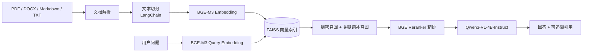

# 企业知识库 RAG（阶段 1）

多模态智能知识库助手的第一阶段：解析 PDF、Word、Markdown、TXT 文档，使用 BGE-M3 生成向量并写入 FAISS；检索到的文本块会作为上下文提供给本地 Qwen，再返回带来源引用的回答。

> `demo_documents/` 中的资料均为虚构演示语料，仅用于展示检索、引用、拒答与评估能力。

## 架构



## 已实现能力

- 文档上传和解析：PDF、`.docx`、Markdown、TXT，单文件最大 25MB。
- 中文语义切分：LangChain `RecursiveCharacterTextSplitter`。
- 向量检索：本地 BGE-M3（1024 维）和 FAISS 内积索引持久化。
- 混合检索：稠密语义召回与关键词补召回合并后，以本地 `bge-reranker-v2-m3` 交叉编码器精排。
- 问答生成：本地 Qwen3-VL-4B-Instruct；答案仅依据检索上下文生成。
- 可信性控制：检索得分低于阈值时明确拒答，不编造内容。
- 使用界面：上传、提问、引用展开、文档列表、单文档删除和清空知识库确认。
- 检索评估：以题目—预期来源映射验证真实的“召回 → 精排”链路。
- 可观测性：本地记录问题摘要、Agent 路由、候选数量、实际引用和端到端耗时；网页展示近期调用与汇总指标。

## 本项目服务器运行方式

模型权重不进入 Git 仓库。首次运行前请准备本地 BGE-M3、Qwen 和 DINOv3 权重；精排模型可通过 ModelScope 下载：

```bash
cd /home/cjy/project/multimodal-rag-assistant
.venv/bin/pip install modelscope
.venv/bin/modelscope download --model BAAI/bge-reranker-v2-m3 --local_dir models/bge-reranker-v2-m3
```

将 `.env.example` 复制为 `.env` 后，按机器实际路径填写模型位置。推荐保留 `RERANKER_DEVICE=cpu`，让 GPU 专用于 Qwen 推理。

```bash
cd /home/cjy/project/multimodal-rag-assistant
.venv/bin/uvicorn app.main:app --host 127.0.0.1 --port 8010
```

Windows 通过 SSH 隧道访问：

```powershell
ssh -N -L 8010:127.0.0.1:8010 my-ai-server
```

随后打开 `http://127.0.0.1:8010/`。推荐使用该网页，而非 Swagger 的上传表单。

## API

- `POST /api/v1/documents`：上传一个或多个文档。
- `GET /api/v1/documents`：列出已上传文档与文本块数。
- `DELETE /api/v1/documents/{source_name}`：删除一个文档的全部文本块并重建索引。
- `POST /api/v1/chat`：提交 `{"question": "...", "top_k": 5}`。
- `GET /api/v1/knowledge-base`：查看索引状态。
- `DELETE /api/v1/knowledge-base`：清空索引。
- `GET /api/v1/observability/summary`：获取近期请求、引用/拒答数量和平均耗时。
- `GET /api/v1/evaluation/summary`：读取最近一次离线评测的 Pass@K 与 MRR。

## 演示语料与评估

`demo_documents/` 提供四份虚构企业制度资料，可和已上传的三份基础示例组合成完整演示知识库。`evaluation/questions.json` 包含 18 道问题及其预期来源。

将语料上传后运行：

```bash
cd /home/cjy/project/multimodal-rag-assistant
.venv/bin/python scripts/evaluate_retrieval.py --top-k 3 --device cpu
```

输出会逐题标记是否检索到预期来源，并汇总混合检索与精排后的 `Pass@3`。精排模型默认使用 CPU，避免与 Qwen 争抢显存。

本次演示语料的验证结果：18 道有依据问题在阈值 `0.50` 下均将预期来源召回至 Top-3；4 道知识库未覆盖的问题均在端到端问答中被拒答且不显示无关引用。离线评估默认在 CPU 运行，避免与常驻 Qwen 争抢显存。

运行评测后，脚本会把结构化结果写入 `data/evaluation_report.json`，网页“评测与可观测性”面板会自动展示 Pass@K 和 MRR。查询事件只保存在服务器本地 `data/query_events.jsonl`，默认最多保留 500 条；不会记录文档原文或完整回答。

## 阶段 2：多模态检索与 Agent（已完成）

已复用 `Sample4Geo_copy` 中的 University DINOv3 训练权重，提供独立于文本 RAG 的视觉检索接口：

- `POST /api/v1/images`：上传 JPG、PNG、WEBP 参考图片并建立图像 FAISS 索引。
- `POST /api/v1/image-search?top_k=5`：上传一张查询图，返回最相似的参考图及相似度。
- `GET /api/v1/image-knowledge-base`：查看视觉图库状态。

视觉编码器固定使用 1024 维、L2 归一化的 DINOv3 检索 Embedding。当前默认在 CPU 执行，避免与常驻 Qwen 抢占 GPU 显存；后续可在显存充足时改为 CUDA。

已在 University 数据集上完成跨视角验证：以地点 1059 的无人机图查询，两张卫星参考图中同地点 1059 排名第一（相似度 `0.8496`），地点 1060 为 `0.4990`。

### Qwen-VL 图片理解（已接入）

`POST /api/v1/multimodal-image-query` 使用同一张上传图片完成两项工作：

1. 由本地 Qwen3-VL-4B-Instruct 描述可见内容；
2. 由 DINOv3 查询视觉 FAISS，返回相似参考图片。

网页中的“理解图片并检索”按钮调用该统一接口。已用 U1652 地点 1059 无人机图验证：Qwen-VL 给出航拍城市街区描述，DINOv3 的 Top-1 仍正确命中地点 1059 卫星图。

### 多模态 RAG 与 Agent

- `POST /api/v1/multimodal-rag-query`：融合上传图片的 Qwen-VL 描述、DINOv3 视觉检索和文本知识库，返回带来源的回答。
- `POST /api/v1/agent`：LangGraph Agent 可路由到“企业知识库检索”或“GPU 状态查询”工具。
- `POST /api/v1/agent/image`：Agent 图片问答复用多模态 RAG 流程。

当前系统已具备文本 RAG、图像检索、多模态回答和工具调用四条可演示链路；下一步建议以真实业务资料替换演示语料，并增加评测集和可观测性。
