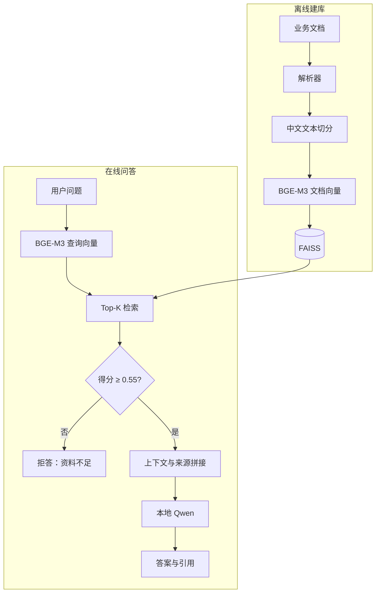

# 企业知识库 RAG 架构说明

```mermaid
flowchart TB
    subgraph Ingestion["离线建库"]
        F["业务文档"] --> P["解析器"] --> S["中文文本切分"] --> EM["BGE-M3 文档向量"] --> V[("FAISS")]
    end
    subgraph Query["在线问答"]
        U["用户问题"] --> QE["BGE-M3 查询向量"] --> RT["Top-K 检索"]
        V --> RT
        RT --> G{"得分 ≥ 0.55?"}
        G -- 否 --> NA["拒答：资料不足"]
        G -- 是 --> CT["上下文与来源拼接"] --> Q["本地 Qwen"] --> A["答案与引用"]
    end
```

系统边界：文档和向量索引保存在项目私有目录；服务仅监听服务器 `127.0.0.1:8010`，客户端通过 SSH 隧道访问。
